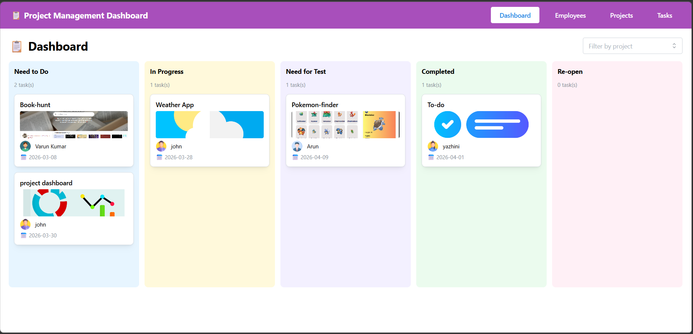

# 📋 Project Management Dashboard

A full-featured Project Management Dashboard built with React, Context API, and Mantine UI. Manage employees, projects, and tasks with a visual Kanban board and drag-and-drop support.

---

## 🚀 Live Demo

[>Deployed link](https://project-dashboard-website.netlify.app/)

---

## 📸 Screenshots




---

## ✨ Features

- **Employee Management** – Add, view, edit, and delete employees with profile images
- **Project Management** – Create projects, assign employees, set start/end dates
- **Task Management** – Create tasks linked to projects, assign to project employees
- **Kanban Dashboard** – Drag and drop tasks across 5 status columns
- **Filter by Project** – View tasks for a specific project on the dashboard
- **Form Validation** – All fields validated using React Hook Form + Yup
- **Data Persistence** – All data saved to localStorage (survives page refresh)
- **Responsive UI** – Works on desktop and tablet screens

---

## 🛠️ Tech Stack

| Technology | Purpose |
|---|---|
| React (CRA) | Frontend framework |
| React Router DOM v7 | Page routing |
| Context API | Global state management |
| Mantine UI v7 | UI component library |
| React Hook Form | Form handling |
| Yup | Form validation |
| @hello-pangea/dnd | Drag and drop |
| uuid v9 | Unique ID generation |
| dayjs | Date handling |
| localStorage | Data persistence |

---

## 📁 Project Structure

```
src/
├── context/
│   └── AppContext.jsx        # Global state (employees, projects, tasks)
├── components/
│   ├── Navbar.jsx            # Top navigation bar
│   ├── EmployeeForm.jsx      # Add/Edit employee modal form
│   ├── ProjectForm.jsx       # Add/Edit project modal form
│   ├── TaskForm.jsx          # Add/Edit task modal form
│   └── TaskCard.jsx          # Draggable task card for Kanban board
├── pages/
│   ├── Dashboard.jsx         # Kanban board with drag and drop
│   ├── Employees.jsx         # Employee list and CRUD
│   ├── Projects.jsx          # Project list and CRUD
│   ├── ProjectDetail.jsx     # Single project detail view
│   └── Tasks.jsx             # Task list and CRUD
├── App.js                    # Route definitions
└── index.js                  # App entry point with MantineProvider
```

---

## ⚙️ Setup and Installation

### Prerequisites

Make sure you have the following installed on your machine:

- [Node.js](https://nodejs.org/) (v16 or above)
- npm (comes with Node.js)

### Step 1 – Clone the Repository

```bash
git clone https://github.com/your-username/project-management-dashboard.git
cd project-management-dashboard
```

### Step 2 – Install Dependencies

```bash
npm install
```

### Step 3 – Start the Development Server

```bash
npm start
```

The app will open at **http://localhost:3000**

---

## 📦 All Dependencies

```bash
npm install @mantine/core@7 @mantine/hooks@7 @mantine/dates@7
npm install react-router-dom
npm install react-hook-form yup @hookform/resolvers
npm install @hello-pangea/dnd
npm install uuid@9 dayjs
```

---

## 📖 How to Use the App

### 1. Add Employees First
- Go to the **Employees** page
- Click **+ Add Employee**
- Fill in name, position, email, and upload a profile image
- Click **Add Employee**

### 2. Create a Project
- Go to the **Projects** page
- Click **+ Add Project**
- Fill in title, description, logo, start date, and end date
- Check the employees you want to assign to this project
- Click **Add Project**

### 3. Create Tasks
- Go to the **Tasks** page
- Click **+ Add Task**
- Select a project first, then select an employee (only project employees appear)
- Fill in title, description, ETA, status, and optional reference images
- Click **Add Task**

### 4. Use the Dashboard
- Go to the **Dashboard** page
- See all tasks across 5 columns: Need to Do, In Progress, Need for Test, Completed, Re-open
- **Drag and drop** any task card to a different column to update its status
- Use the **dropdown** at the top right to filter tasks by project

---

## ✅ Validation Rules

- All fields are **mandatory**
- Email must be **valid format** and **unique** across all employees
- Project **start date must be before end date**
- When creating a task, only employees **assigned to that project** can be selected
- Profile image and project logo are **required**

---

## 🗂️ Pages Overview

| Page | Route | Description |
|---|---|---|
| Dashboard | `/` | Kanban board with drag and drop |
| Employees | `/employees` | View, add, edit, delete employees |
| Projects | `/projects` | View, add, edit, delete projects |
| Project Detail | `/projects/:id` | View single project with its employees and tasks |
| Tasks | `/tasks` | View, add, edit, delete tasks |

---

## 🌐 Deployment

To build the project for production:

```bash
npm run build
```

---

## 👨‍💻 Author

- **Arunthathi**
- GitHub: [@Arunthathi1705](https://github.com/Arunthathi1705)

---

## 📝 License

This project is open source and available under the [MIT License](LICENSE).
